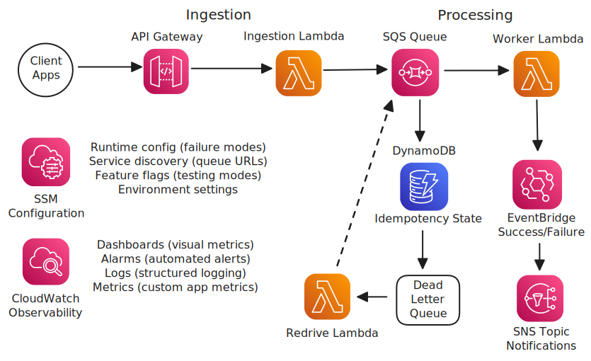

# AWS Serverless Ingestion Pipeline with DLQ

[](https://github.com/Simodalstix/AWS-lambda-sqs-dlq/actions)
[](https://github.com/Simodalstix/AWS-lambda-sqs-dlq/releases)
[](https://opensource.org/licenses/MIT)
[](https://www.python.org/downloads/release/python-3110/)
[](https://docs.aws.amazon.com/cdk/)

A production-ready serverless ingestion pipeline built with AWS CDK, demonstrating enterprise patterns for reliability, observability, and operational excellence.

## What This Builds

**Core Infrastructure:**

- **API Gateway v2** → **Lambda** → **SQS** → **Lambda** → **DynamoDB**
- **Dead Letter Queue** for failed message handling
- **EventBridge** for success/failure notifications
- **CloudWatch** dashboards and automated alarms

**Why This Matters:** This pattern handles millions of events reliably in production environments. Perfect for order processing, data ingestion, or any async workload requiring guaranteed delivery.

## Architecture


Architecture diagram created using AWS official icons and Excalidraw

## Quick Start

### Prerequisites

- AWS CLI configured with deployment permissions
- Python 3.11+
- Node.js 20+ (for CDK CLI)
- Poetry (recommended) or pip

### Deploy

```bash
# Clone and setup
git clone https://github.com/Simodalstix/AWS-lambda-sqs-dlq.git
cd AWS-lambda-sqs-dlq

# Install dependencies
poetry install
# OR: python -m venv .venv && source .venv/bin/activate && pip install -r infra/requirements.txt

# Configure your email for alerts
# Edit infra/cdk.json: "alarmEmail": "your-email@domain.com"

# Deploy infrastructure
cd infra
poetry run cdk bootstrap  # First time only
poetry run cdk deploy --all

# Test the API
curl -X POST $API_URL/events \
  -H "Content-Type: application/json" \
  -d '{"orderId":"test-123","amount":42.50}'
```

## Key Features

### Reliability Patterns

- **Dead Letter Queue** - Failed messages preserved for analysis/retry
- **Idempotency** - Duplicate message protection via DynamoDB
- **Partial Batch Response** - Only failed messages retry
- **Circuit Breaker** - Graceful degradation under load

### Enterprise Observability

- **CloudWatch Dashboard** - Real-time operational metrics
- **Automated Alarms** - Email/SNS notifications for issues
- **Structured Logging** - JSON logs with correlation IDs
- **Custom Metrics** - Business-specific monitoring

### Security & Compliance

- **Least Privilege IAM** - Minimal required permissions
- **KMS Encryption** - Optional customer-managed keys
- **VPC Support** - Private networking ready
- **API Throttling** - Rate limiting and CORS

## Cost & Security Notes

**Estimated Monthly Cost:** ~$20 for 1M requests (dev environment)

- Lambda: ~$8.40 (1M invocations)
- SQS: ~$0.40 (1M messages)
- DynamoDB: ~$1.50 (on-demand)
- API Gateway: ~$3.50
- CloudWatch: ~$5.00

**Security Considerations:**

- All IAM roles follow least privilege
- DynamoDB and SQS support encryption at rest
- API Gateway has throttling enabled
- No hardcoded secrets (uses SSM Parameter Store)

## Project Structure

```
├── infra/                    # CDK Infrastructure
│   ├── stacks/              # CDK stacks
│   ├── cdk_constructs/      # Reusable constructs
│   └── tests/               # Infrastructure tests
├── functions/               # Lambda function code
│   ├── ingest/             # API ingestion handler
│   ├── worker/             # Message processor
│   └── redrive/            # DLQ recovery handler
└── pyproject.toml          # Python dependencies
```

## Testing

```bash
# Validate infrastructure
poetry run cdk synth

# Run unit tests
poetry run pytest

# Test failure scenarios
aws ssm put-parameter --name /ingestion/failure_mode --value poison_payload --type String
```

## DLQ Management

```bash
# Preview failed messages
curl "$API_URL/redrive/preview?maxMessages=10"

# Redrive messages back to main queue
curl -X POST $API_URL/redrive/start \
  -H "Content-Type: application/json" \
  -d '{"maxMessages": 100}'
```

## Monitoring

**Dashboard:** AWS Console → CloudWatch → Dashboards → `IngestionLab-{env}`

**Key Alarms:**

- DLQ depth > 0 (critical)
- Lambda error rate > 1% (critical)
- Queue age > 5 minutes (warning)

## Contributing

1. Fork the repository
2. Create a feature branch: `git checkout -b feature/amazing-feature`
3. Run tests: `poetry run pytest`
4. Commit changes: `git commit -m 'Add amazing feature'`
5. Push to branch: `git push origin feature/amazing-feature`
6. Open a Pull Request

## License

This project is licensed under the MIT License - see the [LICENSE](LICENSE) file for details.

## Support

- **Issues:** [GitHub Issues](https://github.com/Simodalstix/AWS-lambda-sqs-dlq/issues)
- **Documentation:** Check the `docs/` folder for detailed guides
- **AWS Costs:** Use [AWS Pricing Calculator](https://calculator.aws) for estimates

---

**Built for learning AWS serverless patterns and demonstrating production-ready infrastructure practices.**
