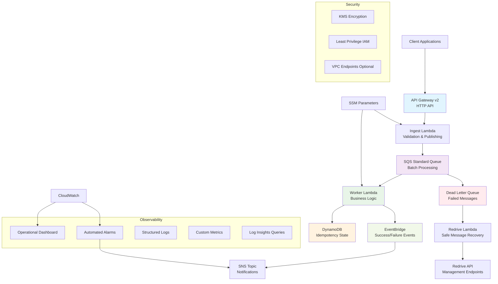

# Event-Driven Ingestion + DLQ Reliability Lab

A production-ready serverless ingestion pipeline demonstrating AWS best practices for reliability, observability, and operational excellence.

## 🎯 Recent Improvements - Well-Architected Enhancement (95% Compliant)

✅ **Exponential Backoff** - Intelligent retry logic with jitter in redrive operations
✅ **Error Categorization** - Systematic error classification (VALIDATION, TRANSIENT, PERMANENT, TIMEOUT, PROCESSING)
✅ **Single Responsibility Functions** - Split monolithic functions into focused components:

- [`functions/validate/`](functions/validate/) - Schema validation only
- [`functions/publish/`](functions/publish/) - SQS publishing only
- [`functions/idempotency/`](functions/idempotency/) - Idempotency checks only
- [`functions/processor/`](functions/processor/) - Business logic only
- [`functions/events/`](functions/events/) - EventBridge publishing only

✅ **Circuit Breaker Pattern** - Resilience for external service calls with service-specific configurations
✅ **Batch Size Optimization** - Dynamic SQS batch sizing based on message size (up to 256KB limit)
✅ **Enhanced Monitoring** - Comprehensive CloudWatch dashboards and alarms with custom metrics
✅ **Visibility Timeout Optimization** - Proper buffer calculations (`worker_timeout + 30s`)

> **📖 Detailed Architecture Guide**: See [`docs/architecture-improvements.md`](docs/architecture-improvements.md) for comprehensive improvement documentation

---

## 🏗️ Architecture



## 🎯 Key Features

### Reliability Patterns

- **Dead Letter Queue (DLQ)** with configurable redrive policy
- **Partial Batch Response** for SQS processing failures
- **Idempotency** using DynamoDB with TTL
- **Circuit Breaker** patterns with failure mode simulation
- **Exponential Backoff** and jitter for redrive operations

### Observability

- **CloudWatch Dashboard** with key operational metrics
- **Automated Alarms** for critical and warning conditions
- **Structured JSON Logging** with correlation IDs
- **Custom Metrics** from log filters
- **X-Ray Tracing** for distributed request tracking
- **Log Insights Queries** for troubleshooting

### Security

- **Least Privilege IAM** roles and policies
- **KMS Encryption** for queues and tables (optional)
- **API Gateway Throttling** and CORS configuration
- **VPC Endpoints** support (configurable)

### Operational Excellence

- **Break/Fix Scenarios** for realistic testing
- **GameDay Exercises** with runbooks
- **Automated Testing** with CDK assertions
- **Infrastructure as Code** with AWS CDK v2

## 📁 Project Structure

```
├── infra/                          # CDK Infrastructure
│   ├── app.py                      # CDK App entry point
│   ├── cdk.json                    # CDK configuration
│   ├── requirements.txt            # Python dependencies
│   ├── constructs/                 # Reusable CDK constructs
│   │   ├── kms_key.py             # KMS encryption construct
│   │   ├── sqs_with_dlq.py        # SQS + DLQ construct
│   │   ├── lambda_fn.py           # Observable Lambda construct
│   │   ├── event_bus.py           # EventBridge construct
│   │   ├── dashboard.py           # CloudWatch dashboard
│   │   └── alarms.py              # CloudWatch alarms
│   ├── stacks/                     # CDK stacks
│   │   ├── api_stack.py           # API Gateway stack
│   │   ├── queue_stack.py         # SQS and DynamoDB stack
│   │   ├── functions_stack.py     # Lambda functions stack
│   │   └── observability_stack.py # Monitoring stack
│   └── tests/                      # CDK unit tests
│       ├── test_queue.py
│       └── test_functions.py
├── functions/                      # Lambda function code
│   ├── common/
│   │   └── utils.py               # Shared utilities
│   ├── ingest/
│   │   └── handler.py             # Ingestion handler
│   ├── worker/
│   │   └── handler.py             # Message processor
│   └── redrive/
│       └── handler.py             # DLQ redrive handler
├── ops/                           # Operational materials
│   ├── runbooks/                  # Incident response guides
│   ├── gamedays/                  # Chaos engineering scenarios
│   └── queries/                   # CloudWatch Insights queries
└── README.md                      # This file
```

## 🚀 Quick Start

### Prerequisites

- AWS CLI configured with appropriate permissions
- Python 3.9+ installed
- Node.js 18+ (for CDK CLI)
- AWS CDK v2 CLI installed

### Deployment

1. **Clone and Setup**

   ```bash
   git clone <repository-url>
   cd AWS-lambda-sqs-dlq

   # Create Python virtual environment
   python -m venv .venv
   source .venv/bin/activate  # On Windows: .venv\Scripts\activate

   # Install dependencies
   pip install -r infra/requirements.txt
   ```

2. **Configure Context (Optional)**

   ```bash
   # Edit infra/cdk.json to customize:
   # - envName: "dev" | "staging" | "prod"
   # - alarmEmail: your-email@domain.com
   # - useKmsCmk: true (for enhanced encryption)
   # - maxReceiveCount: 5 (DLQ threshold)
   ```

3. **Deploy Infrastructure**

   ```bash
   cd infra

   # Bootstrap CDK (first time only)
   cdk bootstrap

   # Deploy all stacks
   cdk deploy --all

   # Note the API Gateway URL from outputs
   ```

4. **Verify Deployment**

   ```bash
   # Test health endpoint
   curl $API_URL/health

   # Send test event
   curl -X POST $API_URL/events \
     -H "Content-Type: application/json" \
     -d '{"orderId":"test-123","amount":42.50}'
   ```

## 🔧 Configuration

### Context Parameters

| Parameter                | Default              | Description                         |
| ------------------------ | -------------------- | ----------------------------------- |
| `envName`                | `dev`                | Environment name (dev/staging/prod) |
| `maxReceiveCount`        | `5`                  | DLQ redrive threshold               |
| `batchSize`              | `10`                 | SQS batch size for worker           |
| `workerTimeoutSeconds`   | `30`                 | Worker Lambda timeout               |
| `queueVisibilitySeconds` | `180`                | SQS visibility timeout              |
| `useKmsCmk`              | `false`              | Use customer-managed KMS key        |
| `alarmEmail`             | `devops@example.com` | Email for alarm notifications       |
| `ttlDays`                | `7`                  | DynamoDB item TTL in days           |

### Failure Mode Testing

Control failure simulation via SSM parameter:

```bash
# Enable poison payload testing
aws ssm put-parameter \
  --name /ingestion/failure_mode \
  --value poison_payload \
  --type String --overwrite

# Available modes:
# - none: Normal operation
# - poison_payload: Schema validation errors → DLQ
# - slow_downstream: Timeout simulation
# - random_fail_p30: 30% random failures
# - duplicate_submit: Idempotency testing

# Reset to normal
aws ssm put-parameter \
  --name /ingestion/failure_mode \
  --value none \
  --type String --overwrite
```

## 📊 Monitoring & Observability

### CloudWatch Dashboard

Access your dashboard at: `https://console.aws.amazon.com/cloudwatch/home#dashboards:name=IngestionLab-{env}`

**Key Metrics:**

- Queue depths and message age
- Lambda invocations, errors, and duration
- API Gateway request rates and latency
- Custom application metrics (processed messages, idempotency hits)

### Alarms

Automated alarms for:

- **Critical**: DLQ depth > 0, Lambda errors, API 5XX errors
- **Warning**: Queue backlog, high latency, throttling

### Log Insights Queries

Pre-configured queries for:

- Error analysis and troubleshooting
- Performance monitoring
- Idempotency pattern analysis
- Failure mode investigation

## 🔄 DLQ Redrive Operations

### Preview DLQ Messages

```bash
curl "$API_URL/redrive/preview?maxMessages=20&errorType=SchemaValidationError&minAgeSeconds=300"
```

### Start Redrive Operation

```bash
curl -X POST $API_URL/redrive/start \
  -H "Content-Type: application/json" \
  -d '{
    "maxMessages": 100,
    "errorType": "SchemaValidationError",
    "minAgeSeconds": 300,
    "perMessageDelayJitter": 5
  }'
```

### Safety Features

- **Minimum Age Filter**: Prevents redriving recent failures
- **Message Jitter**: Adds 0-900s delay to prevent thundering herd
- **Batch Limits**: Maximum 1000 messages per operation
- **Error Type Filtering**: Target specific failure types

## 🧪 Testing & Validation

### Unit Tests

```bash
cd infra
pytest tests/ -v
```

### Integration Testing

```bash
# Test ingestion flow
curl -X POST $API_URL/events \
  -H "Content-Type: application/json" \
  -d '{"orderId":"test-001","amount":99.99}'

# Test idempotency (same payload)
curl -X POST $API_URL/events \
  -H "Content-Type: application/json" \
  -d '{"orderId":"test-001","amount":99.99}'

# Test validation error
curl -X POST $API_URL/events \
  -H "Content-Type: application/json" \
  -d '{"invalidField":"value"}'
```

### Load Testing

```bash
# Simple load test with curl
for i in {1..100}; do
  curl -X POST $API_URL/events \
    -H "Content-Type: application/json" \
    -d "{\"orderId\":\"load-test-$i\",\"amount\":$(($RANDOM % 1000))}" &
done
wait
```

## 💰 Cost Analysis

### Estimated Monthly Costs (us-east-1, dev environment)

| Service            | Usage                     | Cost              |
| ------------------ | ------------------------- | ----------------- |
| **Lambda**         | 1M invocations, 512MB avg | ~$8.40            |
| **SQS**            | 1M messages               | ~$0.40            |
| **DynamoDB**       | 1M writes, 100K reads     | ~$1.50            |
| **API Gateway**    | 1M requests               | ~$3.50            |
| **CloudWatch**     | Logs, metrics, alarms     | ~$5.00            |
| **EventBridge**    | 1M events                 | ~$1.00            |
| **KMS** (optional) | 10K operations            | ~$3.00            |
| **Total**          |                           | **~$19.80/month** |

_Costs scale with usage. Production workloads may benefit from Reserved Capacity for DynamoDB._

## 🚨 Operational Runbooks

### Common Scenarios

1. **DLQ Depth Alarm**

   - Check CloudWatch dashboard for error patterns
   - Review recent deployments or configuration changes
   - Use redrive preview to sample failed messages
   - Fix root cause, then redrive messages

2. **High Latency**

   - Check Lambda duration metrics
   - Review concurrent execution limits
   - Verify downstream dependencies
   - Consider increasing memory allocation

3. **Throttling Issues**
   - Review Lambda concurrency limits
   - Check SQS visibility timeout vs function timeout
   - Adjust batch size and batching window
   - Scale reserved concurrency if needed

## 🎮 GameDay Scenarios

### Scenario 1: Schema Evolution

**Objective**: Handle breaking schema changes gracefully

1. Deploy new validation rules
2. Observe DLQ growth
3. Implement backward compatibility
4. Redrive failed messages

### Scenario 2: Downstream Outage

**Objective**: Manage cascading failures

1. Simulate downstream timeout
2. Monitor queue backlog growth
3. Implement circuit breaker
4. Verify graceful recovery

### Scenario 3: Traffic Spike

**Objective**: Handle unexpected load

1. Generate 10x normal traffic
2. Monitor throttling and errors
3. Adjust concurrency limits
4. Verify auto-scaling behavior

## 🔍 Troubleshooting

### Common Issues

**Messages stuck in main queue**

- Check worker Lambda errors in CloudWatch
- Verify SQS visibility timeout > Lambda timeout
- Review IAM permissions for DynamoDB access

**High DLQ depth**

- Use Log Insights to identify error patterns
- Check for schema validation failures
- Review failure mode SSM parameter

**API Gateway 5XX errors**

- Check Lambda function logs
- Verify environment variables
- Review IAM permissions

**Idempotency not working**

- Verify DynamoDB table permissions
- Check TTL configuration
- Review idempotency key generation

## 📚 Interview Crib Notes

### Key Concepts

**At-least-once delivery**: SQS guarantees message delivery but may deliver duplicates. Handle with idempotency patterns.

**Visibility timeout**: Must exceed Lambda timeout + buffer to prevent message reprocessing during execution.

**Partial batch response**: Return only failed message IDs to retry specific messages, not entire batch.

**DLQ redrive safety**: Always filter by age, add jitter, and limit batch sizes to prevent overwhelming downstream systems.

**Idempotency patterns**: Use deterministic keys, conditional writes, and TTL for cleanup.

### Architecture Decisions

**Standard vs FIFO queues**: Standard for throughput, FIFO for ordering with deduplication (lower throughput).

**Push vs Pull**: Lambda polls SQS (pull) for better cost efficiency and backpressure handling.

**Synchronous vs Asynchronous**: API Gateway → Lambda (sync) for immediate feedback, SQS → Lambda (async) for reliable processing.

**Observability strategy**: Structured logging + custom metrics + distributed tracing for comprehensive visibility.

## 🤝 Contributing

1. Fork the repository
2. Create a feature branch
3. Add tests for new functionality
4. Ensure all tests pass
5. Submit a pull request

## 📄 License

This project is licensed under the MIT License - see the LICENSE file for details.

## 🆘 Support

For issues and questions:

- Check the troubleshooting section
- Review CloudWatch logs and metrics
- Open an issue with detailed error information
- Include relevant log snippets and configuration

---

**Built with ❤️ for learning AWS serverless patterns and operational excellence.**
